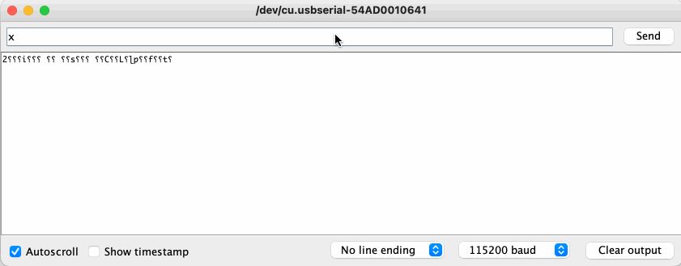
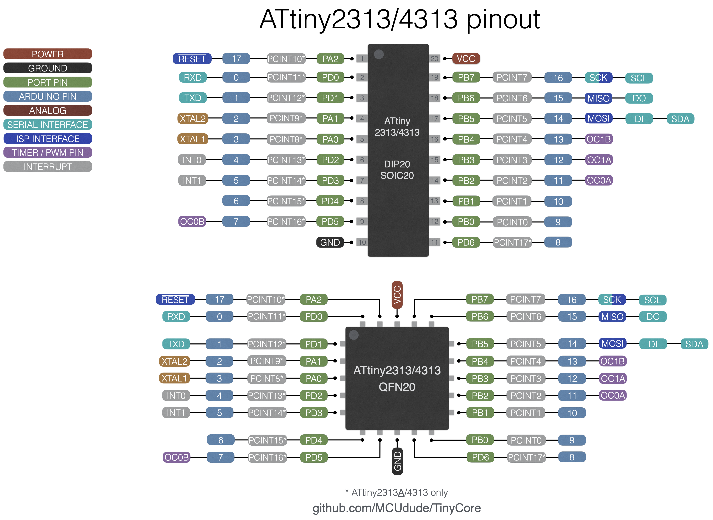

# TinyCore
[](https://forum.arduino.cc/t/tinycore-a-new-arduino-core-for-classic-attiny-chips/1438547)

TinyCore brings full Arduino IDE support to the classic ATtiny microcontroller family. It pairs these capable little chips with the modern and lean [Urboot](https://github.com/stefanrueger/urboot) bootloader and a clean, well-documented experience.

Arduino IDE v1.8 and v2.x are both supported.

TinyCore is a fork of [ATTinyCore 2.0.0](https://github.com/SpenceKonde/ATTinyCore), with focus on a cleaner user experience, up-to-date tooling, and improved documentation. 
Key improvements include:

- **Cleaner Tools menu** - fewer options, as core functionality is automatically optimized away if not used
- **Urboot bootloader** - only 256 bytes, self-protecting, and far more reliable than Optiboot
- **Hardware debugging** via [PyAvrOCD](https://pyavrocd.io)
- **Revised and improved documentation** for every supported chip
- **Systematic hardware testing** - core functionality is [tested on real silicon](/avr/extras/tests/README.md)

# Table of contents
* [Supported microcontrollers](#supported-microcontrollers)
* [Supported clock frequencies](#supported-clock-frequencies)
* [Bootloader](#bootloader)
* [BOD option](#bod-option)
* [EEPROM retain option](#eeprom-option)
* [Printf support](#printf-support)
* [Pin macros](#pin-macros)
* [Internal oscillator calibration (OSCCAL)](#internal-oscillator-calibration-osccal)
* [Write to own flash](#write-to-own-flash)
* [Programmers](#programmers)
* **[How to install](#how-to-install)**
  - [Boards Manager Installation](#boards-manager-installation)
  - [Manual Installation](#manual-installation)
  - [Arduino CLI Installation](#arduino-cli-installation)
  - [PlatformIO](#platformio)
* **[Getting started with TinyCore](#getting-started-with-tinycore)**
* [SPI, i2c and UART](#spi-i2c-and-uart)
* [ADC](#adc)
* [Neopixel library](#neopixel-library)
* [Pin mappings and minimal setup schematics](#pin-mappings-and-minimal-setup-schematics)


## Supported microcontrollers
Each chip family has different pinouts, peripherals, and capabilities. Some differences are obvious, while others are subtle and can affect how features behave. Please read the provided for the specific chip family you are using by clocking the links below. Here you'll find pin mappings, specs, and other important core-related details.

* [ATtiny25/45/85](avr/extras/ATtiny_x5.md)
* [ATtiny24/44/84](avr/extras/ATtiny_x4.md)
* [ATtiny441/841](avr/extras/ATtiny_x41.md)
* [ATtiny261/461/861](avr/extras/ATtiny_x61.md)
* [ATtiny87/167](avr/extras/ATtiny_x7.md)
* [ATtiny48/88](avr/extras/ATtiny_x8.md)
* [ATtiny2313/4313](avr/extras/ATtiny_x313.md)
* [ATtiny1634](avr/extras/ATtiny_1634.md)
* [ATtiny828](avr/extras/ATtiny_828.md)
* [ATtiny43](avr/extras/ATtiny_43.md)
* [ATtiny26](avr/extras/ATtiny_26.md)

<details>
<summary><b>See the specification table for comparison</b></summary>

| **ATtiny**               | 25/45/85     | 24/44/84     | 441/841      | 261/461/861  | 87/167     | 48/88     | 2313/4313 | 1634     | 828      | 43       | 26       |
|--------------------------|--------------|--------------|--------------|--------------|------------|-----------|-----------|----------|----------|----------|----------|
| *Flash*                  | 2/4/8kiB     | 2/4/8kiB     | 4/8kiB       | 2/4/8kiB     | 8/16kiB    | 4/8kiB    | 2/4kiB    | 16kiB    | 8kiB     | 4kiB     | 2kiB     |
| *EEPROM*                 | 128/256/512B | 128/256/512B | 256/512B     | 128/256/512B | 512B       | 64/64B    | 128/256B  | 256B     | 512B     | 64B      | 128B     |
| *RAM*                    | 128/256/512B | 128/256/512B | 256/512B     | 128/256/512B | 512B       | 256/512B  | 128/256B  | 1kiB     | 512B     | 256B     | 128B     |
| *Internal 16 MHz*        | Yes, PLL     | No           | No           | Yes, PLL     | No         | No        | No        | No       | No       | No       | Yes, PLL |
| *Ext. Crystal*           | Yes          | Yes          | Yes          | Yes          | Yes        | No        | Yes       | Yes      | No       | No       | Yes      |
| *HV programming*         | HVSP         | HVSP         | HVSP         | parallel     | parallel   | parallel  | parallel  | parallel | parallel | parallel | parallel |
| *I/O pins (incl. RST)*   | 6            | 12           | 12           | 16           | 16         | 28        | 18        | 18       | 28       | 16       | 16       |
| *Urboot (occupies 256B)* | Yes          | Yes          | Yes          | Yes          | Yes        | Yes       | No        | Yes      | Yes      | No       | No       |
| *PWM pins*               | 3            | 4            | 6            | 3            | 3          | 2         | 4         | 4        | 4        | 4        | 2        |
| *Internal Refs*          | 1V1, 2V56    | 1V1          | 1V1,2V2,4V1  | 1V1, 2V56    | 1V1,2V56   | 1V1       | 1V1       | 1V1      | 1V1      | 1V1      | 2V56     |
| *Analog Pins*            | 4            | 8            | 12           | 11           | 11         | 6 or 8    | none      | 12       | 28       | 4        | 11       |
| *AREF Pin*               | Yes          | Yes          | Yes          | Yes          | Yes        | No        | No        | Yes      | No       | No       |          |
| *Diff. ADC pairs*        | 2            | 12           | "46"* (18)   | "16" (10)    | 8          | none      | none      | none     | none     | none     | 8        |
| *Diff. ADC gain*         | 1x, 20x      | 1x, 20x      | 1x,20x,100x  | 1, 8, 20, 32x| 8x, 20x    | none      | none      | none     | none     | none     | 1x, 20x  |

<b>*</b> The quoted figures originate from Atmel marketing material and are inconsistent with both the counting methodology applied to other parts and fundamental mathematical principles. For example, on the ATtiny441/841, the differential pair count was inflated to 46 by counting each unique pin pair twice (accounting for polarity reversal) and including the 10 channels where the same pin is used as both positive and negative input, intended for offset calibration, these channels will read zero except for offset error. The historically established convention counts only unique pairs and excludes zero-read channels, yielding 18 pairs. Hence the notation: "46" (18).
</details>


## Supported clock frequencies
TinyCore supports a variety of different clock frequencies. Select the microcontroller in the boards menu, then select the clock frequency. *You will have to hit "Burn bootloader" in order to set the correct fuses and upload the correct bootloader. This also has to be done if you want to change any of the fuse settings (BOD and EEPROM settings) regardless if a bootloader is installed or not. Make sure you connect an ISP programmer, and select the correct one in the "Programmers" menu.*

For time-critical operations, an external crystal/oscillator is recommended. Urboot bootloader has automatic baud rate detection on devices that have a *hardware serial port*. You can change the default upload baud rate in the Tools menu. Note that not all baud rates will work with all clock frequency options, due to [UART baud rate error](https://wormfood.net/avrbaudcalc.php) being too high.

Note that the ATtiny48/88 and ATtiny828 require an external clock signal and are not able to drive a resonator circuit themselves. You may use a dedicated quartz crystal oscillator or a crystal driver.

| Frequency   | Oscillator type   | Urboot baud rate | Note                                              |
|-------------|-------------------|------------------|---------------------------------------------------|
| 16 MHz      | Ext. crystal/osc. | 115200           |                                                   |
| 20 MHz      | Ext. crystal/osc. | 115200           |                                                   |
| 18.4320 MHz | Ext. crystal/osc. | 115200           |                                                   |
| 14.7456 MHz | Ext. crystal/osc. | 115200           |                                                   |
| 12 MHz      | Ext. crystal/osc. | 115200           |                                                   |
| 11.0592 MHz | Ext. crystal/osc. | 115200           |                                                   |
| 9.216 MHz   | Ext. crystal/osc. | 115200           |                                                   |
| 8 MHz       | Ext. crystal/osc. | 38400            |                                                   |
| 7.3728 MHz  | Ext. crystal/osc. | 115200           |                                                   |
| 6 MHz       | Ext. crystal/osc. | 57600            |                                                   |
| 4 MHz       | Ext. crystal/osc. | 57600            |                                                   |
| 3.6864 MHz  | Ext. crystal/osc. | 115200           |                                                   |
| 2 MHz       | Ext. crystal/osc. | 9600             |                                                   |
| 1 MHz       | Ext. crystal/osc. | 9600             |                                                   |
| 16 MHz      | Int. osc. (PLL)   | 115200           | ATtiny25/45/85, 24/44/84, 261/461/861 and 26 only |
| 8 MHz       | Int. osc.         | 38400            | Might cause UART upload issues. See comment above |
| 4 MHz       | Int. osc.         | 9600             | Derived from the 8 MHz internal oscillator        |
| 1 MHz       | Int. osc.         | 9600             | Derived from the 8 MHz internal oscillator        |
| 128kHz      | Int. WDT osc.     | 1200             | 128kHz is not recommended for bootloader use      |


## Bootloader
TinyCore supports the ultra-lightweight and lean [Urboot](https://github.com/stefanrueger/urboot) bootloader, written by [Stefan Rueger](https://github.com/stefanrueger). The bootloader makes it trivial to upload sketches using a USB-to-serial adapter, just like with a traditional AVR-based Arduino board. But unlike other bootloaders, Urboot only occupies 256 bytes of flash and protects its patched reset vector, which means that, unlike Optiboot, it's practically impossible to mess up the reset vector and "brick" the chip. Give the bootloader option a try, and you'll be amazed at how well it works!

The internal oscillator on the most ATtinys is usually slower than it should be according to the spec. Try burning the slower and faster ones (-1.25%, +1.25%, etc.) if the "Bootloader: _Yes_" option doesn't work.

Note that the 128 kHz internal oscillator option is not recommended for use with a bootloader since the oscillator is too inaccurate for practical use with an asynchronous protocol like UART.


## BOD option
Brown-out detection, or BOD for short lets the microcontroller sense the input voltage and shut down if the voltage goes below the brown-out setting. To change the BOD settings you'll have to connect an ISP programmer and hit "Burn bootloader". Below is a table that shows the available BOD options:

| All other parts | ATtiny26 | ATtiny43 | 
|-----------------|----------|----------|
| 4.3V            | 4.3V     | 4.3V     |
| 2.7V            | 2.7V     | 2.7V     |
| 1.8V            | Disabled | 2.3V     | 
| Disabled        |          | 2.2V     |                               
|                 |          | 2.0V     |      
|                 |          | 1.9V     |    
|                 |          | 1.8V     | 
|                 |          | Disabled | 


## EEPROM option
If you want the EEPROM to be erased every time you burn the bootloader or upload using a programmer, you can turn off this option. You'll have to connect an ISP programmer and hit "Burn bootloader" to enable or disable "EEPROM retain". Note that when uploading using a bootloader, the EEPROM will always be retained.

If you're using an ISP programmer, data specified in the user program using the `EEMEM` attribute will be uploaded to EEPROM when you upload your program in the Arduino IDE. 

```cpp
#include <avr/eeprom.h>

volatile const char ee_data EEMEM = {"Data that's loaded straight into EEPROM\n"};

void setup() {
}

void loop() {
}
```


## Printf support
Unlike the official Arduino cores, TinyCore (and ATTinyCore for that matter) has printf support out of the box. If you're not familiar with printf, you should probably [read this first](https://www.tutorialspoint.com/c_standard_library/c_function_printf.htm). It's added to the Print class and will work with all libraries that inherit Print. Printf is a standard C function that lets you format text much easier than using Arduino's built-in print and println. Note that this implementation of printf will NOT print floats or doubles. This is disabled by default to save space, but can be enabled using a build flag if using PlatformIO.

If you're using a serial port, simply use `Serial.printf("Milliseconds since start: %ld\n", millis());`. You can also use the `F()` macro if you need to store the string in flash. Other libraries that inherit the Print class (and thus support printf) are the LiquidCrystal LCD library and the U8G2 graphical LCD library.


## Pin macros
Note that you don't have to use the digital pin numbers to refer to the pins. You can also use some predefined macros that map "Arduino pins" to the port and port number. This can result in code that's more portable across different chips and Arduino cores:

```c++
// Use PIN_PB0 macro to refer to pin PB0 (Arduino pin 0 on ATtiny25/45/85)
digitalWrite(PIN_PB0, HIGH);

// Results in the exact same compiled code
digitalWrite(0, HIGH);

```

### Internal oscillator calibration (OSCCAL)
The internal 8 MHz oscillator (or 16 MHz PLL) on these microcontrollers aren't all that accurate, and is both temperature and voltage dependent. Depending on the application, it might be necessary to perform an oscillator calibration. TinyCore provides a simple [Oscillator calibration sketch](avr/libraries/TinyCore/examples/OscillatorCalibration/OscillatorCalibration.ino) that uses the incoming UART data to calibrate its clock. Read more about this in the [device spesific documentation](#supported-microcontrollers).




## Write to own flash
TinyCore uses the excellent Urboot bootloader, written by [Stefan Rueger](https://github.com/stefanrueger). Urboot supports flash writing within the running application, meaning that content from e.g. a sensor can be stored in the flash memory directly without needing external memory. Flash memory is much faster than EEPROM, and can handle at least 10,000 write cycles before wear becomes an issue.
For more information on how it works and how you can use this in your own application, check out the [Flash_put_get](avr/libraries/Flash/examples/Flash_iterate/Flash_iterate.ino) and [Flash_iterate](avr/libraries/Flash/examples/Flash_iterate/Flash_iterate.ino) for useful examples on how you can store strings, structs, and variables to flash and retrieve them afterward.


## Programmers
Select your microcontroller in the boards menu, then select the clock frequency. You'll have to hit "Burn bootloader" in order to set the correct fuses and upload the correct bootloader. <br/>
Make sure you connect an ISP programmer, and select the correct one in the "Programmers" menu.


## How to install
#### Boards Manager Installation
* Open the Arduino IDE.
* Open the **File > Preferences** menu item.
* Enter the following URL in **Additional Boards Manager URLs**: `https://mcudude.github.io/TinyCore/package_MCUdude_TinyCore_index.json`
* Open the **Tools > Board > Boards Manager...** menu item.
* Wait for the platform indexes to finish downloading.
* Scroll down until you see the **TinyCore** entry and click on it.
* Click **Install**.
* After installation is complete close the **Boards Manager** window.

#### Manual Installation
Click on the "Download ZIP" button in the upper right corner. Extract the ZIP file, and move the extracted folder to the location "**~/Documents/Arduino/hardware**". Create the "hardware" folder if it doesn't exist.
Open Arduino IDE, and a new category in the boards menu called "TinyCore" will show up.

Note that a manual installation will not download binary tools such as the most recent avrdude program and the debugging tool.

#### Arduino CLI Installation
Run the following command in a terminal:

```
arduino-cli core install TinyCore:avr --additional-urls https://mcudude.github.io/TinyCore/package_MCUdude_TinyCore_index.json
```

#### PlatformIO
[PlatformIO](http://platformio.org) is an open-source ecosystem for IoT and embedded systems. PlatformIO support is not ready just yet.


## Getting started with TinyCore
Ok, so you have downloaded and installed TinyCore, but how do you get the wheels spinning? Here's a quick start guide:
* Hook up your microcontroller as shown in the minimal setup schematic for the target you have selected.
* Open the **Tools > Board > TinyCore** menu item, and select the chip or chip family, e.g ATtiny25/45/85.
* Select your preferred BOD option. Read more about BOD [here](#bod-option).
* Select your preferred clock frequency. The **8 MHz internal oscillator** is the default setting.
* Select what kind of programmer you're using under the **Programmers** menu. Use one of the **slow** programmers if you're using the 128 kHz oscillator option, e.g., **USBasp slow**.
* Hit **Burn Bootloader** to set the fuses.
* Now that the correct fuse settings are set you can upload your code by using your programmer tool. Simply hit *Upload*, and the code will be uploaded to the microcontroller.


## SPI, i2c and UART
Most of these devices lack hardware support for interfaces such as SPI, i2c and/or UART (Serial), which are commonly available on ATmega devices. To minimize these differences, TinyCore provides modified versions of Wire.h and SPI.h that maintain the standard Arduino APIs while adapting their implementation to the available hardware on each chip.
As a result, code that includes Wire.h or SPI.h should generally work without modification. Because these interfaces are already handled internally, libraries such as USIWire, tinyWire, WireS, and similar alternatives are unnecessary and not supported.
For serial communication, devices without a hardware UART can use the SoftwareSerial library. However, SoftwareSerial relies on pin change interrupts (PCINTs), which prevents those interrupts from being used elsewhere. To avoid this limitation, TinyCore provides an alternative software serial implementation that uses the analog comparator interrupt instead. This allows PCINTs to remain available for other purposes. In this implementation, the RX pin is fixed, while the TX pin can be selected from a limited set of pins.
See the serial section below for additional details.  

<details>
<summary><b>Hardware communication interfaces table</b></summary>

| Part(s)               | SPI           | I2C Master  | I2C Slave | Serial (TX* , RX) |
|-----------------------|---------------|-------------|-----------|-------------------|
| ATtiny2313/4313       | USI           | USI         | USI       | 1x Hardware       |
| ATtiny43              | USI           | USI         | USI       | Software PA4, PA5 |
| ATtiny24/44/84        | USI           | USI         | USI       | Software PA1, PA2 |
| ATtiny25/45/85        | USI           | USI         | USI       | Software PB0, PA1 |
| ATtiny26              | USI           | USI         | USI       | Software PA6, PA7 |
| ATtiny261/461/861     | USI           | USI         | USI       | Software PA6, PA7 |
| ATtiny87/167          | Real SPI      | USI         | USI       | 1x Hardware (LIN) |
| ATtiny48/88           | Real SPI      | Real TWI    | Real TWI  | Software PD6, PD7 |
| ATtiny441/841         | Real SPI      | Software    | Slave TWI | 2x Hardware       |
| ATtiny1634            | USI           | USI         | Slave TWI | 2x Hardware **    |
| ATtiny828             | Real SPI      | Software    | Slave TWI | 1x Hardware       |

<b>*</b>  TX pin can be moved to any other pin on that port with Serial.setTxBit() on parts that uses software-based serial.  
<b>**</b> UART1 shares pins with the USI and slave TWI interface, which basically means you have to choose between USI (SPI or I2C master) or I2C slave, or a second serial port.

</details>

### SPI
On parts with hardware SPI, `SPI.h` behaves the same as on classic AVR devices. On USI-based parts, the interface differs slightly.

<details>
<summary><b>SPI support and differences on USI-based parts</b></summary>

USI uses **DI/DO** instead of **MISO/MOSI**. In master mode, **DI = MISO** and **DO = MOSI**. In slave mode, **DI = MOSI** and **DO = MISO**, though slave mode is not supported by `SPI.h`. The `MISO` and `MOSI` defines therefore assume master mode. For slave implementations with other libraries, `PIN_USI_DI`, `PIN_USI_DO`, and `PIN_USI_SCK` are provided. Do not confuse SPI pins used by sketches with the ISP programming pins, where the device operates as an SPI slave.

USI has no hardware clock generator, so clock dividers are implemented in software. Dividers **2, 4, 8, and ≥14** use separate routines. Passing a constant value to `SPISettings` or `setClockDivider` reduces code size; otherwise all routines and 32-bit math are included. Dividers ≥14 are approximate because the implementation is optimized for size.

Interrupts are not disabled during transfers. If an interrupt occurs during a byte, one clock bit may be stretched. This is usually harmless, but devices requiring consistent clock timing should wrap `transfer()` in `ATOMIC_BLOCK` or disable interrupts.

USI-based **SPI and i2c cannot be used simultaneously**, as they share the same hardware and pins.
</details>


### i2c
i2c support varies between devices. The ATtiny48 and ATtiny88 provide hardware i2c and behave like ATmega devices. As with SPI, the `Wire.h` library handles most differences, and code generally works without modification.

<details>
<summary><b>i2c support and limitations, USI, and slave-only parts</b></summary>

Most other devices implement i2c using USI. In these cases:

* **External pull-up resistors are required.** Unlike hardware TWI implementations, USI-based i2c cannot rely on internal pull-ups.
* The i2c master clock cannot be configured. The SCL frequency is fixed.

A few devices support hardware i2c slave mode only, with neither USI nor hardware TWI available for master operation. On these parts:

* i2c slave mode is supported through the included `Wire.h` library.
* Alternate or masked slave addresses can be configured via the `TWSAM` register. This register functions as on newer AVRs, but no wrapper API is provided.
* On the ATtiny828, the watchdog timer must be enabled for i2c operation due to a silicon erratum. Enabling the WDT in interrupt mode with an empty handler is sufficient.

Software i2c master implementations on these devices are unreliable. In particular, timeouts cannot be distinguished from slaves returning zero data, and clock configuration is not supported. Simultaneous master and slave operation is not supported on any of these devices.

##### Buffer size
Devices with more than 128 bytes of SRAM use a **32-byte buffer**. Smaller devices use **16 bytes**. However, most libraries assume a 32-byte buffer, so TinyCore uses a 32-byte buffer on larger devices even when this consumes a significant portion of available RAM.
</details>


### Serial/UART
All devices provide a `Serial` object. On parts with hardware UART, `Serial` behaves as a standard full-duplex AVR serial interface. Devices with two UARTs also provide `Serial1`. Most supported devices do not include hardware UART and instead use software serial.

<details>
<summary><b>Hardware and software serial</b></summary>

This core is compatible with the standard `SoftwareSerial` library, but that implementation uses all PCINT vectors. To avoid this, TinyCore provides a built-in software serial implementation that uses the analog comparator interrupt instead of PCINT. The RX pin is fixed to **AIN1**, while TX defaults to **AIN0** and can be moved to a limited set of pins.

Software serial can operate only one instance at a time. Transmission is always blocking: data is sent immediately rather than buffered as with hardware UART. Calls such as `Serial.print()` therefore return only after transmission completes.

```c
Serial.print("Hello World\n");
// On parts without hardware UART this is equivalent to:
Serial.print("Hello World\n");
Serial.flush();
```

##### Moving builtin soft-serial TX pin
On parts without hardware serial, the TX pin can be moved to another pin *on the same port* using `Serial.setTxBit(bit)`. The bit value must be between 0 and 7 and corresponds to the bit position within the port. This must be called before `Serial.begin()`.

##### TX only soft serial
The built-in software serial implementation makes it possible to only enable the TX only. This can be done in the Tools menu, or adding `-DSOFT_TX_ONLY` as a build flag in PlatformIO. TX only will exclude everything except the transmit functionality. read() and peek() will always return -1, and available() will always return 0.

##### Internal oscillator and Serial
Reliable UART communication requires accurate clock timing. The internal oscillator on many classic ATtiny devices is calibrated to approximately ±10%, which may be insufficient for serial communication. Some devices operate correctly without tuning, but others require calibration using OSCCAL.
The ATtiny x41 family, ATtiny1634R, and ATTiny828R include an oscillator calibrated to ±2%, but only below 4 V. At higher voltages the oscillator frequency increases, which can cause UART timing errors depending on baud configuration. Clock menu options are provided to compensate when operating above 4 V.
Because of these limitations, applications that rely on serial communication are generally best served by using an external crystal, except on devices with tighter oscillator calibration.
</details>


## ADC
Unlike official Arduino cores, TinyCore doesn't let you refer to analog input pins with just their channel number (0 for instance), you'll either have to use the Ax macros (A0 for instance) or use the equivalent digital pin number instead.  
This means that for an ATtiny841, you can either use `analogRead(A10)`, `analogRead(PIN_PB1)` or `analogRead(9)`.

Analog pin labels (A0 for instance) cannot be used with `digitalWrite()`, `digitalRead()`, or `analogWrite()`. All pins must be referenced by their digital pin numbers for these functions. Analog pin labels should be used only with analogRead(). This differs from the behavior on official AVR boards, but allows access to advanced ADC features on some ATtiny chips with minimal impact. In practice, clear and well-written code is unlikely to be affected by this.

Some parts have additional ADC functionality like differential inputs, programmable gain, bipolar mode and noise reduction. See the table below and read the appropriate [TinyCore target spesific documentation](#supported-microcontrollers) on how to utilize this functionality.

<details>
<summary><b>TinyCore ADC functionality overview</b></summary>

| **ATtiny**           | 25/45/85 | 24/44/84 | 441/841 | 261/461/861 | 87/167 | 48/88 | 2313/4313 | 1634 | 828 | 43 | 26 |
|----------------------|----------|----------|---------|-------------|--------|-------|-----------|------|-----|----|----|
| *Has ADC*            | ✅       | ✅        | ✅      | ✅          | ✅      | ✅    | ❌        | ✅    | ✅  | ✅ | ✅  |
| *ADC inputs*         | 4        | 12       | 12      | 11          | 11     | 6/8   |           | 12   | 28  | 4  | 11 |
| *Diff. support*      | ✅       | ✅       | ✅       | ✅          | ✅      | ❌    |           | ❌    | ❌  | ❌ | ✅  |
| *Bipolar mode*       | ✅       | ✅       | ❌       | ✅          | ✅      | ❌    |           | ❌    | ❌  | ❌ | ✅  |
| *Prog. gain*         | ❌       | ❌       | ✅       | ✅          | ❌      | ❌    |           | ❌    | ❌  | ❌ | ❌  |
| *Noise reduct. mode* | ✅       | ✅       | ✅       | ✅          | ✅      | ✅    |           | ✅    | ✅  | ✅ | ✅  |


Note that the number of analog input pins includes the input that may be multiplexed with the RESET pin. The RESET pin has to be disabled to utilize this input.
</details>

### Special analog channels
This core also implements "special" analog channels that can be read using `analogRead()`. Different parts have different channels.

<details>
<summary><b>Here is an overview of the various "special" analog channels</b></summary>

| **ATtiny**           | 25/45/85 | 24/44/84 | 441/841 | 261/461/861 | 87/167 | 48/88 | 2313/4313 | 1634 | 828 | 43 | 26 |
|----------------------|----------|----------|---------|-------------|--------|-------|-----------|------|-----|----|----|
| `ADC_GROUND`         | ✅       | ✅       | ✅       | ✅          | ✅      | ✅    | ❌        | ✅    | ✅  | ✅ | ✅  |
| `ADC_INTERNAL1V1`    | ✅       | ✅       | ✅       | ✅          | ✅      | ✅    |           | ✅    | ✅  | ✅ | ✅  |
| `ADC_TEMPERATURE`    | ✅       | ✅       | ✅       | ✅          | ✅      | ✅    |           | ✅    | ✅  | ✅ | ✅  |
| `ADC_VCC`            | ❌       | ❌       | ✅       | ❌          | ✅      | ❌    |           | ❌    | ✅  | ❌ | ❌  |
| `ADC_VBATDIV2`       | ❌       | ❌       | ❌       | ❌          | ❌      | ❌    |           | ❌    | ❌  | ✅ | ❌  |
| `ADC_AVCCDIV4`       | ❌       | ❌       | ❌       | ❌          | ✅      | ❌    |           | ❌    | ❌  | ❌ | ❌  |
</details>

### Differential ADC support
Some parts will additionally have one or two additional configuration functions related to the differential mode.

<details>
<summary>Read more about this configuration here</summary>

#### analogGain()
analogGain() is unique to the ATtiny841/441, which has too many differential channels and gain setting combinations to fit into a single byte. It is documented in the [ATtiny841/441 page](avr/extras/ATtiny_x41.md) as it only applies to those devices. All others with programmable gain pass the gain setting as part of the constant.

#### setADCBipolarMode(bool bipolar)
Enables or disables bipolar mode for the differential ADC on supported devices. Bipolar mode (true) returns a signed value representing the voltage difference between the positive and negative inputs. For example, with a 1.0 V reference, a +0.25 V difference returns +128, while reversing the inputs returns −128.
Unipolar mode (false) returns only positive values, and is the default behaviour. If the negative input exceeds the positive input, the result is 0. This mode provides one extra bit of resolution when the signal polarity is known.

#### ADC noise reduction mode
High ADC gain (up to 100× on ATtiny441/841 and 32× on ATtiny261/461/861) increases sensitivity to noise. For accurate measurements, proper hardware layout is recommended. In particular, the AVCC pin should be filtered as described in the datasheet (typically using an inductor), rather than tied directly to VCC. To reduce internal noise during conversions, use ADC noise reduction mode, which temporarily puts the CPU to sleep while the ADC performs a conversion.
Use `analogRead_NR()` instead of `analogRead()` to enable this behavior.

Notes:
* The I/O clock stops during conversion (~65–130 µs), so timers pause and PWM output stops during that time.
* Pin change interrupts and the watchdog interrupt can wake the CPU early, which may affect reading quality.
* Do not disable global interrupts, as the ADC interrupt is required to wake the CPU.
* `analogRead_NR()` uses the ADC interrupt vector.
</details>


## Neopixel library
Standard NeoPixel libraries (for WS2812 and similar LEDs) do not support all clock speeds used by this core, and some are limited to specific ports.
To address this, this core includes two compatible libraries based on Adafruit_NeoPixel; [tinyNeoPixel](avr/libraries/tinyNeoPixel/) and [tinyNeoPixel_Static](avr/libraries/tinyNeoPixel_Static/). The latter introduces minor changes beyond expanded clock and port support in order to reduce flash usage.

The original Adafruit implementation assumes perfectly fixed timing; by allowing small, non-critical timing variations, this core implements the functionality without requiring manual port selection.

The libraries have not been fully tested at unusual clock speeds, but they are confirmed to work at 8, 10, 12, 16, and 20 MHz, and are expected to function at other frequencies greater than 7.3728 MHz.

See the tinyNeoPixel documentation and the included examples for additional details.


## Pin mappings and minimal setup schematics

### ATtiny25/45/85

| Pinout diagram                                  | Minimal setup schematic                                  |
|-------------------------------------------------|----------------------------------------------------------|
| |  |


### ATtiny24/44/84

| Pinout diagram                                  | Minimal setup schematic                                  |
|-------------------------------------------------|----------------------------------------------------------|
| |  |


### ATtiny441/841

| Pinout diagram                                   | Minimal setup schematic                                 |
|--------------------------------------------------|---------------------------------------------------------|
| |  |


### ATtiny261/461/861

| Pinout diagram                                   | Minimal setup schematic                                     |
|--------------------------------------------------|-------------------------------------------------------------|
| |  |


### ATtiny87/167

| Pinout diagram                                  | Minimal setup schematic                                |
|-------------------------------------------------|--------------------------------------------------------|
| |  |


### ATtiny48/88

| Pinout diagram DIP-28                              | Pinout diagram TQFP-32                                           | Minimal setup schematic                                          |
|----------------------------------------------------|------------------------------------------------------------------|------------------------------------------------------------------|
| |<center></center> |  |


### ATtiny2313/4313

| Pinout diagram                                    | Minimal setup schematic                                              |
|---------------------------------------------------|----------------------------------------------------------------------|
| |  |


### ATtiny1634

| Pinout diagram                                    | Minimal setup schematic                                         |
|---------------------------------------------------|-----------------------------------------------------------------|
| |  |


### ATtiny828

| Pinout diagram                                   | Minimal setup schematic                                        |
|--------------------------------------------------|----------------------------------------------------------------|
| |  |


### ATtiny43U

| Pinout diagram                                  | Minimal setup schematic                                        |
|-------------------------------------------------|----------------------------------------------------------------|
| |  |


### ATtiny26

| Pinout diagram                                  | Minimal setup schematic                                       |
|-------------------------------------------------|---------------------------------------------------------------|
| |  |
